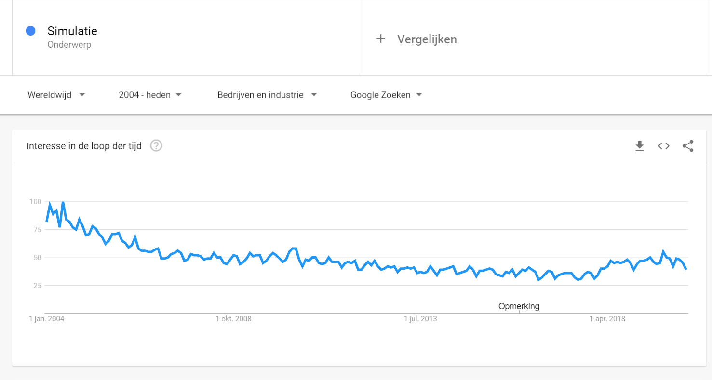

# De Stelling:

## De stelling: “In het bedrijfsleven wordt steeds meer in software gesimuleerd”

### inleiding:
In deze reflectie ga ik na of mijn standpunt dat er inderdaad steeds meer simulatie software wordt gebruikt in het bedrijfsleven.

### Onderzoeksmethode:
Om onderzoek naar de stelling te doen heb ik eerst de stelling uit elkaar gehaald. Hieruit ben ik gaan zoeken naar de diverse onderdelen en heb deze gecombineerd. Zo zijn zoekopdrachten zoals "simulatoren in het bedrijfsleven" "simulaties voor bedrijven" en "type software die bedrijven gebruiken" tot stand gekomen. Vanuit deze zoekopdrachten ben ik begonnen met gewone google en heb mezelf uitgebreid naar google scholar waar meer specifieke artikelen staan. Na deze te hebben gelezen haal ik er data uit en trek ik een conclusie die mijn standpunt erop versterkt of verzwakt. Met meer tijd en betere informatiebronnen is het mogelijk om zelf met de cijfers te werken en erachter te komen of dit daadwerkelijk klopt, echter is dat meer een opdracht voor afstudeeropdracht of thesis. 

### Kern en vindingen
In 1990 werd was er een onderzoek gedaan naar de diverse strategische planning- en voorspellingsmethoden door Drs. D. J. Nicolai en Dr. Th. J. B. M. Postma. In deze studie wordt besproken hoe bekend de methodes zijn en het actief gebruik ervan in het bedrijfsleven. Uit deze studie kwam dat het gebruiken van een simulatie bij 77% van de geënquêteerden bekend was en 28% gebruikte deze methode daadwerkelijk op actieve wijze. Dit laat goed zien dat vroeger de simulatie als voorspellings methode door een groot gedeelte van het bedrijfsleven gebruikt wordt en bekendheid zal dit alleen maar bevorderen. Uit deze studie bleek ook de simulatie een midden prioriteit te zijn in het bedrijfsleven.

Simenco, een simulatie producerend bedrijf heeft een artikel afgeleverd in 2013 met de voordelen die simulaties kunnen hebben in het onderwijs voor docenten en hoewel het bedrijf niet meer lijkt te bestaan zijn de punten die worden gemaakt relevant. Volgens Pavloff: "De grote kracht van een simulatie is dat het inzicht kan geven in dynamische, complexe processen.
Management is zo een dynamisch en complex proces." (Pavloff, 2013). De simulaties leren de studenten, leerlingen en beginnende werknemers hoe ze om moeten gaan met diverse processen en geven een beeld weer van de complexiteit van zaken. Ook levert de simulatie praktijkervaring op en verstevigd de simulatie ook het begrip op de sociale context. 

In 2018 kwam de Nyenrode business universiteit met een artikel waarin ze uitleggen dat ze voor hun bachelor business Administration een simulatie laten gebruiken. Deze simulatie is het laatste vak wast de bachelors moeten volgen. In dit vak gaan ze in groepen een simulatie van een autofabriek door en moeten het bedrijf door diverse scenario's trekken en er beter uit laten komen. De Studenten ervaren dit als de meeste leerzame en leuke manier van lesgeven omdat ze de vaardigheden en kennis kunnen toepassen in een realistisch scenario. De simulatie levert praktijkervaring op die je als beginnende werknemer hard nodig hebt. Niet alleen scholen kunnen goed gebruik maken van de simulatie maar ook bedrijven die nieuwe werknemers willen trainen.

Zulke training simulatoren wordt door het bedrijf Cesim gemaakt. Cesim maakt simulatie software en games die in het bedrijfsleven gebruikt kunnen worden om werknemers op te leiden. Ze leveren simulatoren voor hotel en winkels tot aan de marketing van grote bedrijven. Cesim heeft diverse locaties over de wereld en is een deelnemer in de educatie van Finland met de software.

Uit persoonlijke ervaring weet ik dat het merendeel van het Hemapersoneel opgeleid wordt door middel van simulaties die ze trainen om de kassa te ondernemen, de klantenservice te runnen en om de horeca te onderhouden. op deze manier kunnen beginnende werknemers thuis oefenen met klanten zonder dat er iets fout kan gaan in de winkel. 

Uit google trends kunnen we achterhalen hoe vaak er naar simulaties gezocht wordt over de hele wereld sinds 2004.
 In deze grafiek is het zichtbaar dat de trend omlaag gaat sinds de 2004 echter is het weer langzaam populair aan het worden sinds 2018. Hoewel het niet omhoog gaat in een duidelijke curve is het nog wel relevant in de wereld.

### Conclusie
Hoewel de simulaties niet populairder lijken te worden is er toch nog hoop binnen het bedrijfsleven voor de simulaties. Ze worden al jarenlang gebruikt voor voorspelingsmethodes en als trainingssoftware voor zowel studenten als beginnend personeel. De simulaties blijven verbeteren in kwaliteit en zullen niet snel verdwijnen. Of ze meer worden gebruikt? Dat denk ik wel, tegenwoordig zijn we meer met computers bezig dan in 1990. Er is grote kans dat als het onderzoek van Postma en Nicolai nu zou herhaald worden de simulatie een hoger gebruikspercentage zou hebben. We zullen meer in de toekomst gaan doen met simulaties zeker nu virtual reality populair begint te worden.

### bronvermelding:
business simulatie games. (2020). Retrieved from Cesim.com: https://www.cesim.com/nl/simulaties/business-simulatie-games/

Google trends. (2020, april 05). Retrieved from Google: https://trends.google.nl/trends/explore?cat=12&date=all&q=%2Fm%2F0bwzm

Nicolai, D. D., & Postma, D. T. (1990, februari). Strategische planning- en voorspellingsmethoden in het Nederlandse bedrijfsleven. Amsterdam, Noord Holland, Nederland: Maandblad voor Accountancy en Bedrijfseconomie. [MAB artikel](/MAB_article.pdf)

Pavloff, N. (2013). Verrijk uw opleiding en verlaag uw kosten met managementsimulaties . Retrieved from Simenco.nl: https://www.simenco.com/wp-content/uploads/2018/08/kracht-van-simulaties.pdf

Studenten klaargestoomd voor internationale carrière met simulatie. (2018, oktober 26). Retrieved from nyenrode: https://www.nyenrode.nl/nieuws/n/studenten-klaargestoomd-voor-internationale-carri%C3%A8re-met-simulatie

---
---