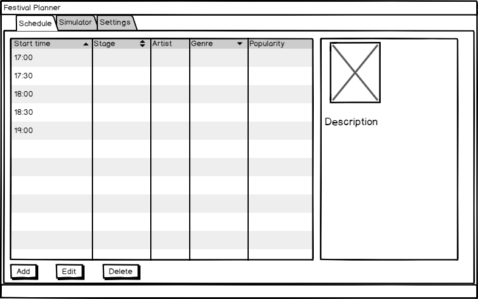
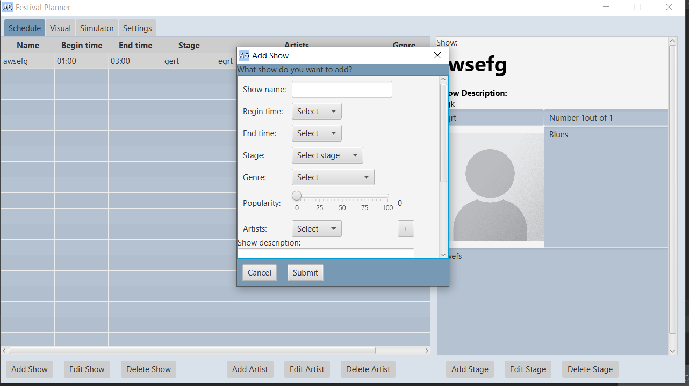

# Reflectie van week 2

## Context:
In week 1 was ik niet bij de eerste opstartcollege en vergadering dus heb ik een stuk gemist van het werk aan het project. ik heb in deze week dus wat moeten bijhalen en wilde laten blijken dat ik de gemiste tijd in wilde halen. in week 2 heb een groot gedeelte van de Gui op me genomen.

### Situatie 1: basisscherm
Ik had de schets van de Gui als leidend gebruikt en heb vanuit daar een begin gemaakt.

Tijdens het maken van het basisscherm van de agenda module had ik een keuze, de structuur stond er al maar had geen functie, ik kon werken met andere aan de data kant van de applicatie om dit te versnellen of ik kon de subtabbladen gaan maken.

### Situatie 2: subtabbladen
De subtabbladen waren niet uit geschetst en moest ik dus zelf invulling geven. Deze ben ik na dat ik het hoofdblad had gemaakt verder gaan uitwerken.
______

## De mogelijkheden:

### Situatie 1:

#### mogelijkheid 1:

De planner zo laten en aan de data kant gaan werken, dit zou er voor zorgen dat voortgang vaan de GUI still komt te liggen omdat op het moment ik de enige was die aan de GUI table view aan het werk was. Ik zou ook behoorlijk wat tijd moeten nemen om de tot nu toe gemaakte data code door te nemen zodat ik weet wat er nog gedaan moet worden.

#### mogelijkheid 2: 

Ik kon nog wat werk doen aan de GUI en zeker de subtabbladen die nog moesten toegevoegd worden. hierdoor zou ik niet kunnen helpen met de Data kant door dat te versnellen maar zou de Gui visueel er goed uit komen te zien.

### Situatie 2:

#### mogelijkheid 1:
Ik kon de subtabladden toevoegen als een lijst van items die de gebruiker moet invoeren net als bij diverse websites waar de klantgegevens in een lijst staan. Dit is herkenbaar voor de grbuiker maar maakt het scherm heel lang. 

#### mogelijkheid 2: 
Ik kon ook de subtabbladen breder maken om de zelfde verhouding in lengte en breedte te houden als het hoofdtabblad. dit zou zich beter bij de stijl houden van het hoofdtabblad.

____
## Resultaat:
### Situatie 1:

Ik heb me gehouden aan het werken aan de GUI en heb voor mogelijkheid 2 gekozen. 

### Situatie 2:
mogelijkheid 1 was hierbij het besluit geworden. ik zou de subtabbladen als een lijst maken.

___
## De Redenering:
### Situatie 1:
Als ik te veel tijd kwijt ben aan bijkomen bij de data kant vreesde ik dat het al klaar zou zijn en dat ik mijn tijd zou verdoen er aan. het zou verstandiger zijn om voortgang te maken met de Gui zodat deze zover mogelijk klaar is voor de data.

### Situatie 2:
Door de subtabbladen ene andere verhouding te geven ten opzichte van het hoofdtabblad ziet de GUI er dynamischer uit. ook de herkenbaarheid voor de klant is een juiste manier om deze tabbladden in te stellen.
