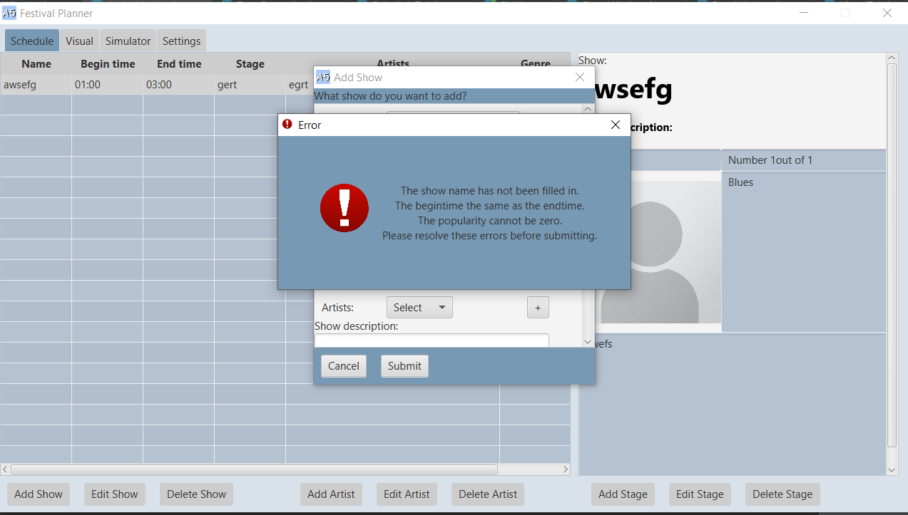
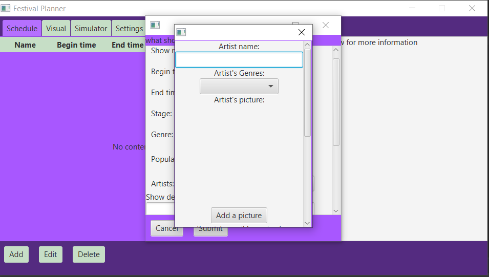
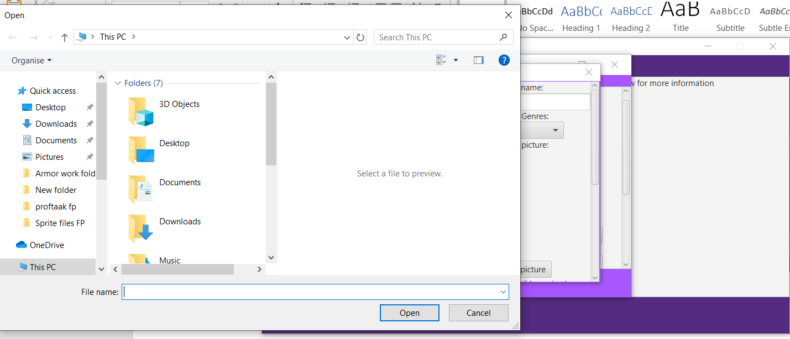
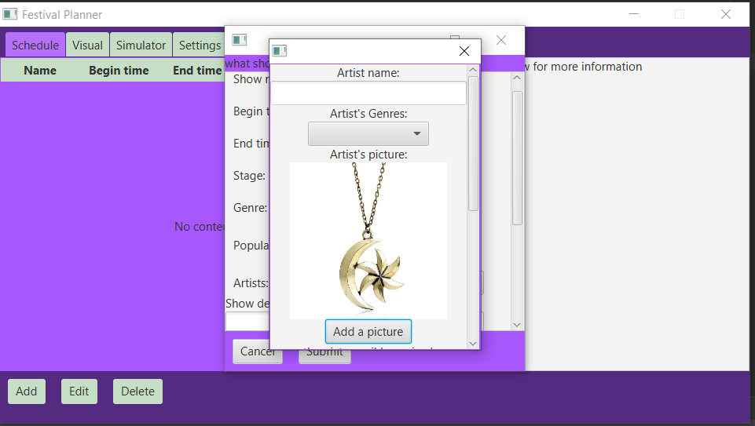

# Reflectie van week 3


## Situatie 1:

### Context:
De gebruiker kan foute informatie invullen op het moment en daar wordt niks mee gedaan. de gebruiker zal dan de fouten alleen zien en geen controle op er krijgt. zodra de data werkt zal deze het controleren maar zal geen foutmelding geven aan de gebruiker. 

---

### Mogelijkheden:
#### Mogelijkheid 1:
De gebruiker krijgt een custom error window waar deze de fouten kan aflezen die deze heeft gemaakt tijdens het invoeren van gegevens. 

#### Mogelijkheid 2:
De gebruiker zal na het falen geen berichtgeving krijgen voorlopig omdat we er van uitgaan dat dat niet veel gaat gebeuren. 

#### Mogelijkheid 3:
De foutieve text kleurt rood met een label onder de input velden met een tip hoe dat komt.

---
### Resultaat:
Mogelijkheid 2 was geen optie en mogelijkheid 3 was meer werk om de structuur van de subtabellen aan te passen dus ik heb gekozen voor mogelijkheid 1. De errorwindow is er zo uit komen te zien.



---

### Redenering:
Mogelijkheid 2 is niet gebruikersvriendelijk en ronduit onhandig tijdens testen. Mogelijkheid 3 is meer werk maar is zeker een optie voor aan het einde van het project als er tijd over is. Hierom heb ik besloten om een nieuwe window te laten komen in met de fouten die gemaakt zijn. 

---
---

## Situatie 2:
### Context:
We hadden een optie bij een artist toevoegen die de gebruiker toe zou laten om een foto aan de artist te koppelen. Deze functie heeft me aanzienlijk wat tijd gekost om te proberen werkend te krijgen in de afgelopen weken. Op het moment staat de functie dat de applicatie een foto eenmalig kan inladen en laten zien aan de gebruiker, echter als het nogmaals geprobeerd wordt breakt de applicatie en de data laadt het niet toe om de image op te slaan. het gaat veel tijd kosten om het misschien werkend te krijgen dus de vraag is of het het waard is om daar mijn focus op te leggen. Er moeten namelijk meer aanpassingen gemaakt worden binnenkort.

Code snippet:

```Java
Label artistPictureLabel = new Label("Artist's picture:");
        newArtistList.getChildren().add(artistPictureLabel);
        newArtistList.getChildren().add(this.artistImage);
        Button artistPictureInput = new Button("Add a picture");
        newArtistList.getChildren().add(artistPictureInput);
        newArtistList.getChildren().add(new Label("the picture wil be resized"));
        newArtistList.getChildren().add(new Label("to 200X200 pixels"));


        artistPictureInput.setOnAction(event -> {
            File selectedFile = fileChooser.showOpenDialog(this.currentStage);
            fileChooser.setInitialDirectory(new File("Resources"));
            fileChooser.getExtensionFilters().addAll(
                    new FileChooser.ExtensionFilter("PNG Files", "*.png")
                    , new FileChooser.ExtensionFilter("Jpg Files", "*.jpg")
                    , new FileChooser.ExtensionFilter("Jpeg Files", "*.jpeg")
            );
            try {
                BufferedImage bufferedArtistImage = ImageIO.read(selectedFile);
                Image image = SwingFXUtils.toFXImage(bufferedArtistImage, null);
                artistImage.setImage(image);
            } catch (Exception e) {
                this.errorList.add("this is not an image file: choose a Jpeg/Jpg/PNG file");
                new ErrorWindow(this.currentStage, this.errorList);
                System.out.println("failed image");
                System.out.println("Exception:" + e);
            }
        });

``` 

Image van de stand tot nu toe:







Stukje van de foutmelding:


Exception in thread "JavaFX Application Thread" java.lang.StackOverflowError
	at com.google.gson.internal.$Gson$Types.canonicalize($Gson$Types.java:106)
	at com.google.gson.reflect.TypeToken.<init>(TypeToken.java:72)
	at com.google.gson.reflect.TypeToken.get(TypeToken.java:296)
	at com.google.gson.internal.bind.TypeAdapterRuntimeTypeWrapper.write(TypeAdapterRuntimeTypeWrapper.java:56)
	at com.google.gson.internal.bind.ReflectiveTypeAdapterFactory$1.write(ReflectiveTypeAdapterFactory.java:127)
	at com.google.gson.internal.bind.ReflectiveTypeAdapterFactory$Adapter.write(ReflectiveTypeAdapterFactory.java:245)
	at com.google.gson.internal.bind.TypeAdapterRuntimeTypeWrapper.write(TypeAdapterRuntimeTypeWrapper.java:69)
	at com.google.gson.internal.bind.ReflectiveTypeAdapterFactory$1.write(ReflectiveTypeAdapterFactory.java:127)
	at com.google.gson.internal.bind.ReflectiveTypeAdapterFactory$Adapter.write(ReflectiveTypeAdapterFactory.java:245)
	at com.google.gson.internal.bind.ObjectTypeAdapter.write(ObjectTypeAdapter.java:107)
	at com.google.gson.internal.bind.TypeAdapterRuntimeTypeWrapper.write(TypeAdapterRuntimeTypeWrapper.java:69)
	at com.google.gson.internal.bind.ReflectiveTypeAdapterFactory$1.write(ReflectiveTypeAdapterFactory.java:127)
	at com.google.gson.internal.bind.ReflectiveTypeAdapterFactory$Adapter.write(ReflectiveTypeAdapterFactory.java:245)
	at com.google.gson.internal.bind.TypeAdapterRuntimeTypeWrapper.write(TypeAdapterRuntimeTypeWrapper.java:69)
	at com.google.gson.internal.bind.ReflectiveTypeAdapterFactory$1.write(ReflectiveTypeAdapterFactory.java:127)
	at com.google.gson.internal.bind.ReflectiveTypeAdapterFactory$Adapter.write(ReflectiveTypeAdapterFactory.java:245)
	at com.google.gson.internal.bind.ObjectTypeAdapter.write(ObjectTypeAdapter.java:107)
	at com.google.gson.internal.bind.TypeAdapterRuntimeTypeWrapper.write(TypeAdapterRuntimeTypeWrapper.java:69)
	at com.google.gson.internal.bind.ReflectiveTypeAdapterFactory$1.write(ReflectiveTypeAdapterFactory.java:127)
	at com.google.gson.internal.bind.ReflectiveTypeAdapterFactory$Adapter.write(ReflectiveTypeAdapterFactory.java:245)
	at com.google.gson.internal.bind.TypeAdapterRuntimeTypeWrapper.write(TypeAdapterRuntimeTypeWrapper.java:69)
	at com.google.gson.internal.bind.ReflectiveTypeAdapterFactory$1.write(ReflectiveTypeAdapterFactory.java:127)
	at com.google.gson.internal.bind.ReflectiveTypeAdapterFactory$Adapter.write(ReflectiveTypeAdapterFactory.java:245)
	at com.google.gson.internal.bind.ObjectTypeAdapter.write(ObjectTypeAdapter.java:107)


_____

### De mogelijkheden:

#### Mogelijkheid 1:
Blijven proberen tot de oplossing er is, desnoods schakel ik de hulp van de senior in. hierdoor zouden andere functie moeten wachten en is foutmeldingen oplossen een stuk moeilijker worden.


#### Mogelijkheid 2:
De functie verwijderen en de focus leggen op andere onderdelen van de applicatie. Het zou zonde zijn van de moeite die besteed is om het zover te krijgen maar het hindert de voortgang.

___
### Resultaat:

Na nogmaals 1 keer proberen met een verse blik op de code heb ik besloten de functie te schrappen voor nu en het later toe te voegen als er aan het einde van het project nog tijd over is. Het resultaat was dus uiteindelijk mogelijkheid 2. 


___
### De Redenering:

Na alle ideeën te hebben uitgeput zag ik geen manier om het probleem op te lossen. De Functie was half werkend en gaf foutmeldingen bij andere onderdelen van de applicatie, voornamelijk het data gedeelte, dus het was verstandig om de functie te schrappen en later het overnieuw doen als er nog tijd over is. De gehele groep was het hier mee eens en ik heb het toen verwijderd op donderdag.


