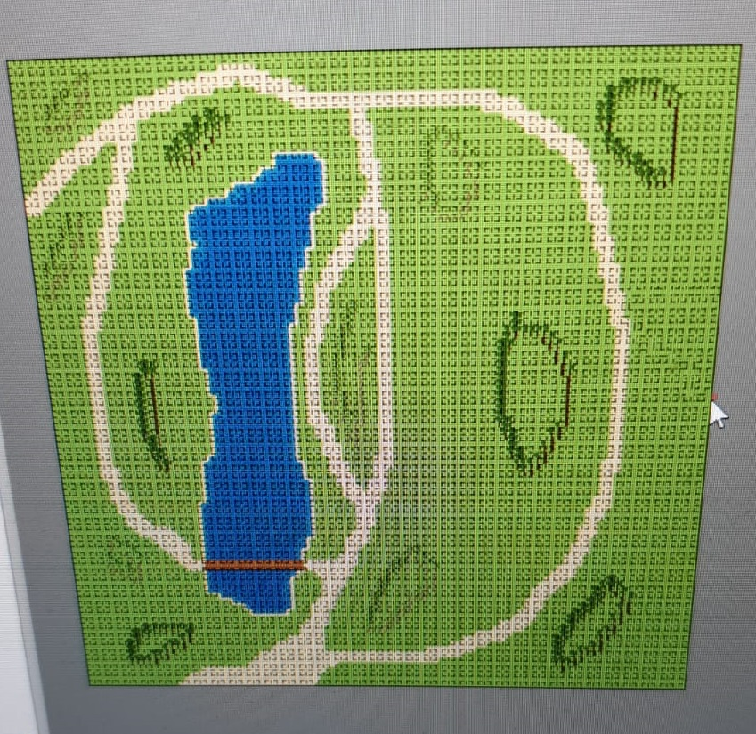

# Reflectie van week 5

## Context:

### Situatie 1:
Na het opstart college van de NPC's hebben we besloten om eerst het PVA als groep af te maken en daarna verder te werken aan het project. De helft zou aan de NPCs werken en de andere helft aan de map. Ik ben gezet op de NPCs. Na goed te kijken naar de NPC's zie ik dat het niet veel werk is en hoor ik dat er problemen zijn bij de map maken. De map zou custom assets nodig hebben voor bepaalde onderdelen. dit zou moeilijk zijn om te maken en zou veel tijd en mankracht kosten.

### Situatie 2:
De map waarop de NPC's op moeten lopen voor de simulator heeft alleen een design en geen eerste poging door de rest van het team dat we daar op hadden gezet. De map had na de vakantie af moeten zijn en hebben daar na de vakantie nog eens over gesproken. Toen 4 mensen niks hebben laten weten heb ik op vrijdag maar naar de stand van zaken gevraagd samen met Lars. hieruit bleek dat er nogsteeds geen voortgang was door "workflow issues". Na een lange discussie hebben we maar besloten met zn allen om de issues te bespreken op Maandag. echter waren er geen afspraken gemaakt over wat er nu zou gebeuren met de map.

___
## De mogelijkheden:
### Situatie 1:
#### mogelijkheid 1:
Ik zou de verdeling van mensen aan kunnen passen naar 2 bij npc en 4 bij de map, zo zouden zij genoeg mensen moeten hebben als er custom sprites gemaakt zouden moeten worden. echter als ik mis inschat hoeveel werk de NPC's zijn dan zitten wij met minder mensen. 

#### mogelijkheid 2:
De samenstelling en verdeling is prima, laat ze maar harder werken. het moet met 3 man ook lukken.

### Situatie 2:
#### mogelijkheid 1:
Ik zou me handen van de map kunnen houden en me aan mijn eigen onderdelen focussen. deze zou ik nog verder kunnen uitbreiden en verbeteren. dit zou een betere NPC opleveren aan het einde. Ook zou het me de kans kunnen geven om rustig weekend te kunnen houden.

#### mogelijkheid 2:
Ik zou me compleet in Tiled kunnen storten en de map alvast een basis geven zodat het team wat na het weekend zich er op gaat focussen hem verder kan afmaken. Dit zou voor mij meer werk betekenen en me een deel van mijn weekend afnemen maar wel het project niet nog verder achter laten lopen.

___
## Resultaat:
### Situatie 1:
Ik heb het besluit genomen wat hopelijk het meeste zal opleveren door Ralf te verplaatsen naar de map. op deze manier zouden we hopelijk een fatsoenlijke map krijgen met mogelijke custom sprites.

### Situatie 2:
Ik heb me gestort op het maken van de map en kwam na het weekend terug met een basis van de map en een begrip van het programma.

Het resultaat na het weekend:

___
## De Redenering:
### Situatie 1:
De NPC's lijken niet veel mankracht nodig te hebben en het is zonde van de tijd als iemand de hele tijd niks te doen heeft bij een onderdeel terwijl het andere onderdeel meer hulp nodig heeft. Op deze manier lopen we de verloren tijd in. Hier was later, bij een klassikaal moment, iedereen die naar me heeft geluisterd het mee eens. 

### Situatie 2:
Ook ik moet Tiled leren gebruiken en ik kon het net toestaan dat het project nog verder achter op schema zou lopen dus vandaar dat ik de map maar zou maken ondanks het feit dat het niet mijn taak was en van mijn weekend wilde genieten. De keuze was voor mij niet moeilijk, liever een goed/werkend product aflevren dan op mijn dak krijgen omdat ik van mijn weekend wilde genieten.
