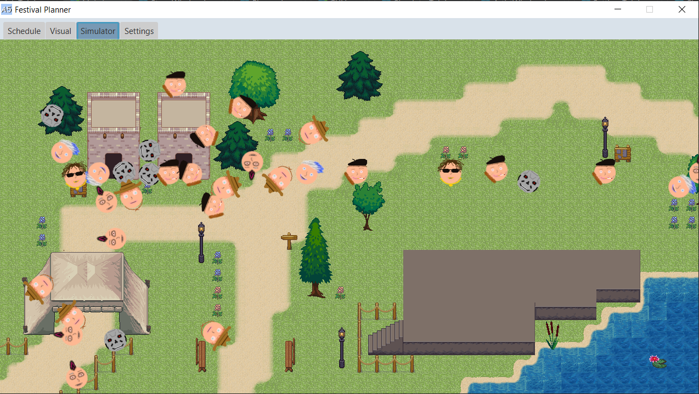

# Reflectie van week 7

## Situatie 1: Merge Applicatie en map
### Context:
Op 16/3 had ik tijd om aan het project te werken en kwam tot de conclusie gekomen dat het belangrijkste dat ik kon doen was de merge maken tussen de hoofd applicatie en de simulator. Echter is het aanzienlijk laat om nog werk af te leveren.
___
### De mogelijkheden:

#### Mogelijkheid 1:
Ik kunnen wachten met het mergen van de applicatie tot het volledig besproken is. Het project zou wel wat achterstand krijgen en het eind product is nu dan nog niet helemaal zichtbaar. 

#### Mogelijkheid 2:
Ik zou het project kunnen mergen in de applicatie repository. Hier staat de structuur al in en zal minder werk zijn om te vermaken.

___
### Resultaat:
Na tijd te hebben gemaakt heb ik een copy van de applicatie project gemaakt en heb een copy van de simulator er in geplaatst om te testen en alles te verbinden. Het is gelukt na wat werk om te doen en het resultaat ziet er als volgt uit:

___
### De Redenering:
Ik wil zo veel mogelijk doen om het project snelheid te geven dus heb besloten om de merge zelf te doen en heb een tijdje er aan gewerkt.

---
---